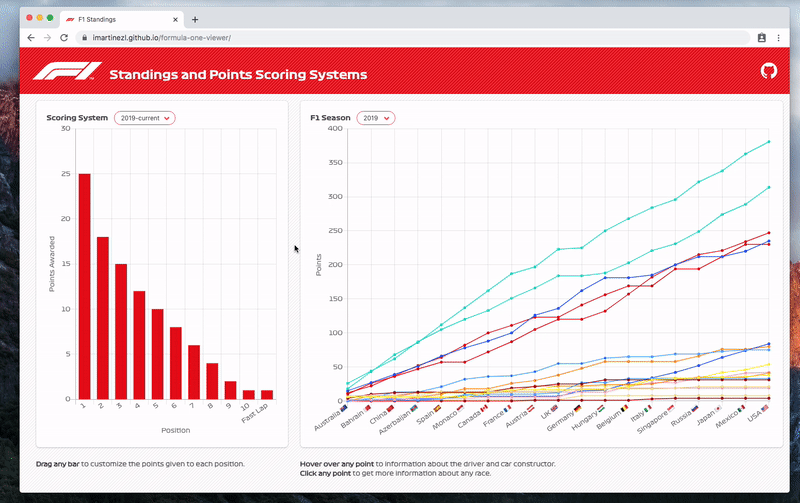

# formula-one-viewer

Interactive F1 data visualization platform: available [HERE](https://imartinezl.github.io/formula-one-viewer/). 

Allows to explore the history of F1 Standings and compare them with different point scoring systems.

## Built with

- [webpack](https://webpack.js.org/)
- [babel.js](https://babeljs.io/)
- [bulma](https://bulma.io/)
- [chart.js](https://www.chartjs.org/)
- [chartjs-plugin-dragdata](https://github.com/chrispahm/chartjs-plugin-dragdata)
- [chartjs-plugin-zoom](https://github.com/chartjs/chartjs-plugin-zoom)
- [country-emoji](https://github.com/meeDamian/country-emoji)

## Data Sources

- [Ergast API](http://ergast.com/mrd/)
- [Points scoring systems](https://en.wikipedia.org/wiki/List_of_Formula_One_World_Championship_points_scoring_systems)

